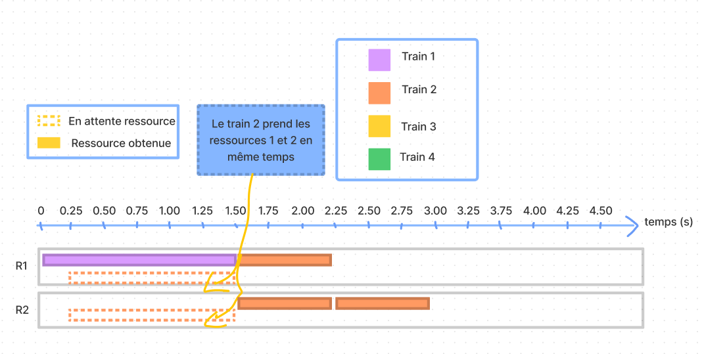
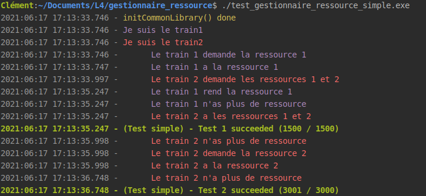
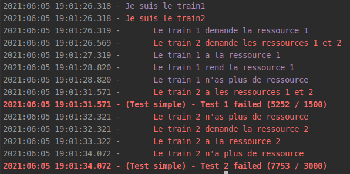

# Gestionnaire de ressources

Ce dossier contient le code du gestionnaire de ressources ainsi que son test unitaire.

## Compilation

Un `makefile` a été crée pour simplifier la compilation. Il vous suffit d'exécuter les 
commandes suivantes :

- Pour générer les exécutables : 
```shell
make
```

- Pour supprimer les exécutables : 
```shell
make clean
```


## Le gestionnaire de ressource

Il y a une mutex qui sert lors de la prise de plusieurs ressources : sans cette mutex, on pourrait se 
retrouver dans une situation de bloquage (exemple : le train 1 demande la ressource 1 et 2, 
le train 2 demande la ressource 1 et 2 également, le train 1 obtient uniquement la 
ressource 1 et le train 2 obtient uniquement la ressource 2 : on sera donc une situation 
de bloquage).

Ensuite, il y a une mutex définie par ressource.

## Le protocole utilisé

Un protocole a été défini pour la communication avec les autres PCs.

Premièrement, lorsqu'un PC se connecte au gestionnaire des ressources, il doit envoyer son numéro de train.
Il peut le faire avec un trame comme ceci :
```
T:$NumeroTrain
// exemple: 'T:1' pour le train 1
```

Ensuite, il peut demander des ressources avec la requête suivante :

```
DD:NB_RESSOURCE:RESSOURCE1/RESSOURCE2/.../RESSOURCE_N

/**************** EXEMPLE ********************/
DR:1:2      // demande la ressource 2
DR:2:3/4    // demande les ressources 3 et 4
DR:4:1/3/11/12 // demande les ressources 1,3,11 et 12
```

Ensuite, il peut rendre des ressources avec la requête suivante :

```
DD:NB_RESSOURCE:RESSOURCE1/RESSOURCE2/.../RESSOURCE_N

/**************** EXEMPLE ********************/
RR:1:2      // rend la ressource 2
RR:2:3/4    // rend les ressources 3 et 4
RR:4:1/3/11/12 // rend les ressources 1,3,11 et 12
```

## Les programmes de test

### Compilation

L'exécutable de test est automatiquement généré par le makefile. Il suffit donc d'exécuter la commande suivante :

```shell
make
```

### Le programme de test simple

Pour l'utiliser, il faut d'abord lancer le gestionnaire de ressources :

```shell
./gestionnaire_ressource.exe
```

Ensuite, il faut ouvrir un autre terminal et lancer le programme test :

```shell
./test_gestionnaire_ressource_simple.exe
```

Voici ce que fait le programme de test simple :



Voici ce que la console affiche lorsque le test fonctionne :



### Debug

Si les tests ne fonctionne pas et vous ne comprenez pas pourquoi, vous pouvez décommenter cette ligne dans le fichier 
`common.h` :

```c
#define DEBUG
```

Voici ce que la console affiche une fois le debug activé :



Si les tests échouent, une raison possible peut être que les requêtes mettent trop de temps à arriver.

#Files

- `gestionnaire_ressource.c` : Le code du gestionnaire de ressources
- `test_gestionnaire_ressource_simple.c` : Le code test du gestionnaire de ressources
- `tester.c/.h` : Quelques fonctions utiles pour tester le gestionnaire de ressources